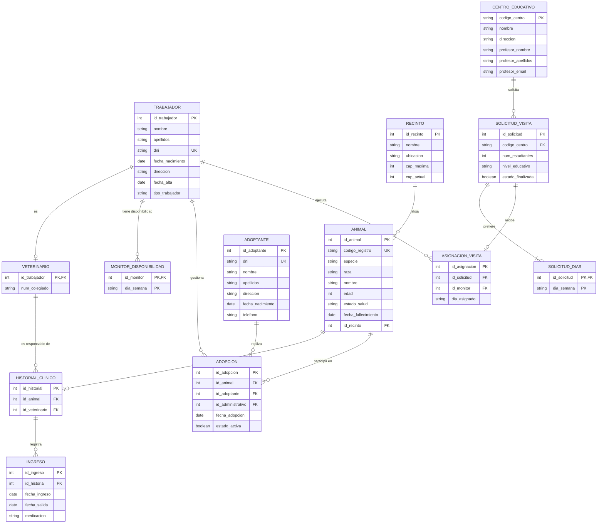

# prueba

```mermaid
erDiagram
    TRABAJADOR {
        int id_trabajador PK
        string nombre
        string apellidos
        string dni UK
        date fecha_nacimiento
        string direccion
        date fecha_alta
        string tipo_trabajador
    }
    VETERINARIO {
        int id_trabajador PK, FK
        string num_colegiado
    }
    MONITOR_DISPONIBILIDAD {
        int id_monitor PK, FK
        string dia_semana PK
    }
    RECINTO {
        int id_recinto PK
        string nombre
        string ubicacion
        int cap_maxima
        int cap_actual
    }
    ANIMAL {
        int id_animal PK
        string codigo_registro UK
        string especie
        string raza
        string nombre
        int edad
        string estado_salud
        date fecha_fallecimiento
        int id_recinto FK
    }
    HISTORIAL_CLINICO {
        int id_historial PK
        int id_animal FK
        int id_veterinario FK
    }
    INGRESO {
        int id_ingreso PK
        int id_historial FK
        date fecha_ingreso
        date fecha_salida
        string medicacion
    }
    ADOPTANTE {
        int id_adoptante PK
        string dni UK
        string nombre
        string apellidos
        string direccion
        date fecha_nacimiento
        string telefono
    }
    ADOPCION {
        int id_adopcion PK
        int id_animal FK
        int id_adoptante FK
        int id_administrativo FK
        date fecha_adopcion
        boolean estado_activa
    }
    CENTRO_EDUCATIVO {
        string codigo_centro PK
        string nombre
        string direccion
        string profesor_nombre
        string profesor_apellidos
        string profesor_email
    }
    SOLICITUD_VISITA {
        int id_solicitud PK
        string codigo_centro FK
        int num_estudiantes
        string nivel_educativo
        boolean estado_finalizada
    }
    SOLICITUD_DIAS {
        int id_solicitud PK, FK
        string dia_semana PK
    }
    ASIGNACION_VISITA {
        int id_asignacion PK
        int id_solicitud FK
        int id_monitor FK
        string dia_asignado
    }

    TRABAJADOR ||--o| VETERINARIO : "es"
    TRABAJADOR ||--o{ MONITOR_DISPONIBILIDAD : "tiene disponibilidad"
    RECINTO ||--o{ ANIMAL : "aloja"
    ANIMAL ||--o| HISTORIAL_CLINICO : "posee"
    VETERINARIO ||--o{ HISTORIAL_CLINICO : "es responsable de"
    HISTORIAL_CLINICO ||--o{ INGRESO : "registra"
    ANIMAL ||--o{ ADOPCION : "participa en"
    ADOPTANTE ||--o{ ADOPCION : "realiza"
    TRABAJADOR ||--o{ ADOPCION : "gestiona"
    CENTRO_EDUCATIVO ||--o{ SOLICITUD_VISITA : "solicita"
    SOLICITUD_VISITA ||--|{ SOLICITUD_DIAS : "prefiere"
    SOLICITUD_VISITA ||--o| ASIGNACION_VISITA : "recibe"
    TRABAJADOR ||--o{ ASIGNACION_VISITA : "ejecuta"
```

