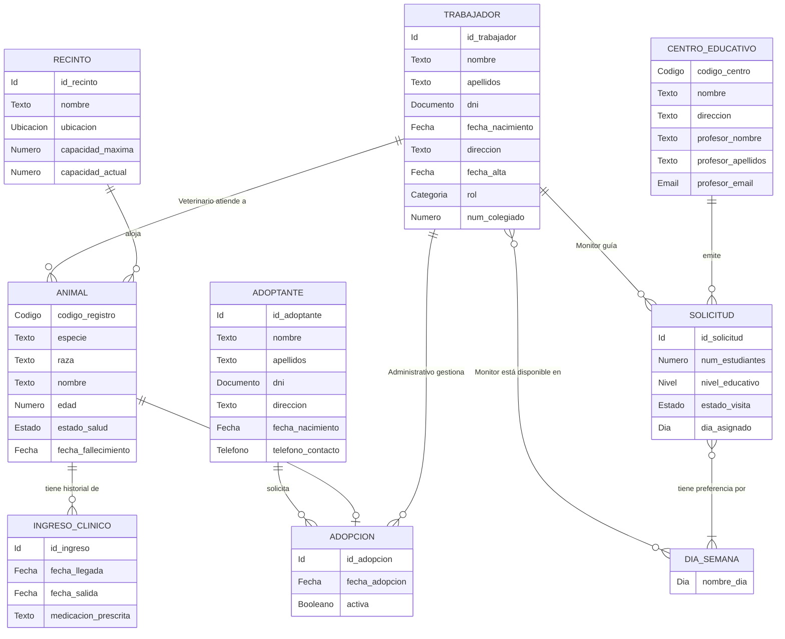

# prueba

```mermaid
erDiagram
    %% Entidades principales y sus atributos (sin claves foráneas)
    TRABAJADOR {
        Id id_trabajador
        Texto nombre
        Texto apellidos
        Documento dni
        Fecha fecha_nacimiento
        Texto direccion
        Fecha fecha_alta
        Categoria rol
        Numero num_colegiado
    }

    ANIMAL {
        Codigo codigo_registro
        Texto especie
        Texto raza
        Texto nombre
        Numero edad
        Estado estado_salud
        Fecha fecha_fallecimiento
    }

    RECINTO {
        Id id_recinto
        Texto nombre
        Ubicacion ubicacion
        Numero capacidad_maxima
        Numero capacidad_actual
    }

    ADOPTANTE {
        Id id_adoptante
        Texto nombre
        Texto apellidos
        Documento dni
        Texto direccion
        Fecha fecha_nacimiento
        Telefono telefono_contacto
    }

    CENTRO_EDUCATIVO {
        Codigo codigo_centro
        Texto nombre
        Texto direccion
        Texto profesor_nombre
        Texto profesor_apellidos
        Email profesor_email
    }

    SOLICITUD {
        Id id_solicitud
        Numero num_estudiantes
        Nivel nivel_educativo
        Estado estado_visita
        Dia dia_asignado
    }

    INGRESO_CLINICO {
        Id id_ingreso
        Fecha fecha_llegada
        Fecha fecha_salida
        Texto medicacion_prescrita
    }

    ADOPCION {
        Id id_adopcion
        Fecha fecha_adopcion
        Booleano activa
    }

    DIA_SEMANA {
        Dia nombre_dia
    }

    %% Relaciones conceptuales de negocio
    TRABAJADOR ||--o{ ANIMAL : "Veterinario atiende a"
    TRABAJADOR ||--o{ SOLICITUD : "Monitor guía"
    TRABAJADOR }o--o{ DIA_SEMANA : "Monitor está disponible en"
    
    RECINTO ||--o{ ANIMAL : "aloja"
    
    ANIMAL ||--o{ INGRESO_CLINICO : "tiene historial de"
    
    %% Relación ternaria de adopción resuelta conceptualmente
    ADOPTANTE ||--o{ ADOPCION : "solicita"
    ANIMAL ||--o| ADOPCION : "protagoniza"
    TRABAJADOR ||--o{ ADOPCION : "Administrativo gestiona"
    
    CENTRO_EDUCATIVO ||--o{ SOLICITUD : "emite"
    SOLICITUD }o--|{ DIA_SEMANA : "tiene preferencia por"
```

