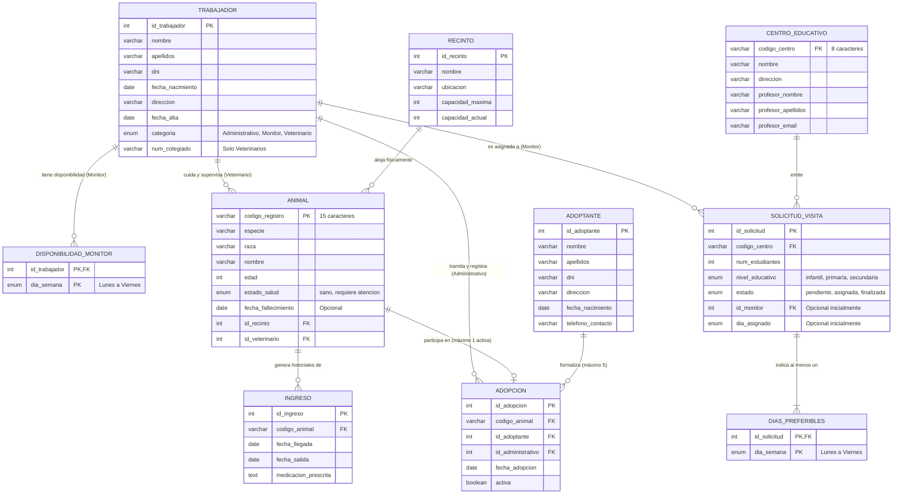

# prueba

```mermaid
erDiagram
    TRABAJADOR {
        int id_trabajador PK
        varchar nombre
        varchar apellidos
        varchar dni
        date fecha_nacimiento
        varchar direccion
        date fecha_alta
        enum categoria "Administrativo, Monitor, Veterinario"
        varchar num_colegiado "Solo Veterinarios"
    }

    DISPONIBILIDAD_MONITOR {
        int id_trabajador PK, FK
        enum dia_semana PK "Lunes a Viernes"
    }

    RECINTO {
        int id_recinto PK
        varchar nombre
        varchar ubicacion
        int capacidad_maxima
        int capacidad_actual
    }

    ANIMAL {
        varchar codigo_registro PK "15 caracteres"
        varchar especie
        varchar raza
        varchar nombre
        int edad
        enum estado_salud "sano, requiere atencion"
        date fecha_fallecimiento "Opcional"
        int id_recinto FK
        int id_veterinario FK
    }

    INGRESO {
        int id_ingreso PK
        varchar codigo_animal FK
        date fecha_llegada
        date fecha_salida
        text medicacion_prescrita
    }

    ADOPTANTE {
        int id_adoptante PK
        varchar nombre
        varchar apellidos
        varchar dni
        varchar direccion
        date fecha_nacimiento
        varchar telefono_contacto
    }

    ADOPCION {
        int id_adopcion PK
        varchar codigo_animal FK
        int id_adoptante FK
        int id_administrativo FK
        date fecha_adopcion
        boolean activa
    }

    CENTRO_EDUCATIVO {
        varchar codigo_centro PK "8 caracteres"
        varchar nombre
        varchar direccion
        varchar profesor_nombre
        varchar profesor_apellidos
        varchar profesor_email
    }

    SOLICITUD_VISITA {
        int id_solicitud PK
        varchar codigo_centro FK
        int num_estudiantes
        enum nivel_educativo "infantil, primaria, secundaria"
        enum estado "pendiente, asignada, finalizada"
        int id_monitor FK "Opcional inicialmente"
        enum dia_asignado "Opcional inicialmente"
    }

    DIAS_PREFERIBLES {
        int id_solicitud PK, FK
        enum dia_semana PK "Lunes a Viernes"
    }

    %% Relaciones (Cardinalidades)
    TRABAJADOR ||--o{ DISPONIBILIDAD_MONITOR : "tiene disponibilidad (Monitor)"
    TRABAJADOR ||--o{ ANIMAL : "cuida y supervisa (Veterinario)"
    TRABAJADOR ||--o{ ADOPCION : "tramita y registra (Administrativo)"
    TRABAJADOR ||--o{ SOLICITUD_VISITA : "es asignado a (Monitor)"
    
    RECINTO ||--o{ ANIMAL : "aloja físicamente"
    
    ANIMAL ||--o{ INGRESO : "genera historiales de"
    ANIMAL ||--o| ADOPCION : "participa en (máximo 1 activa)"
    
    ADOPTANTE ||--o{ ADOPCION : "formaliza (máximo 5)"
    
    CENTRO_EDUCATIVO ||--o{ SOLICITUD_VISITA : "emite"
    
    SOLICITUD_VISITA ||--|{ DIAS_PREFERIBLES : "indica al menos un"
```

